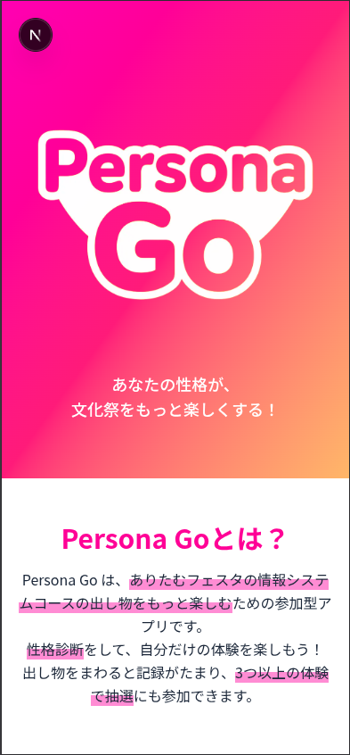
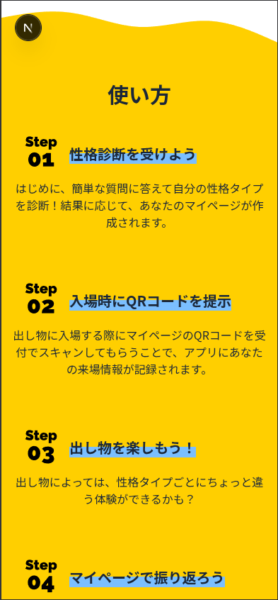
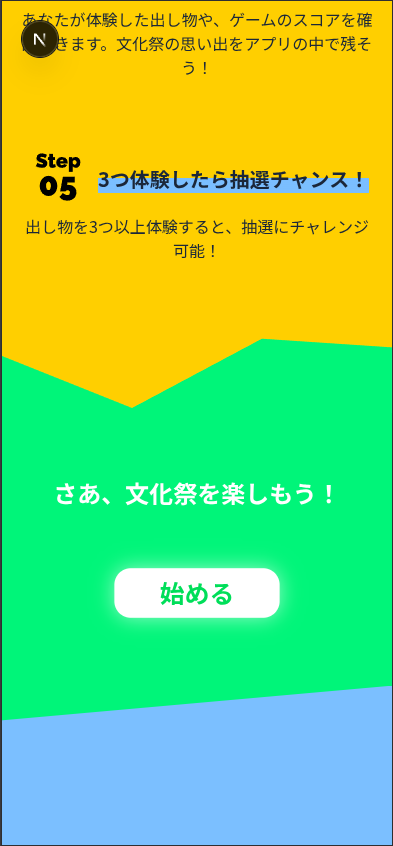
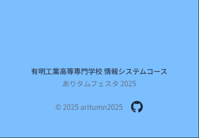
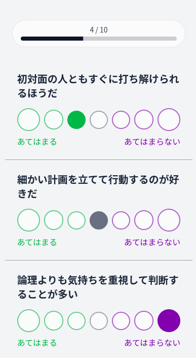
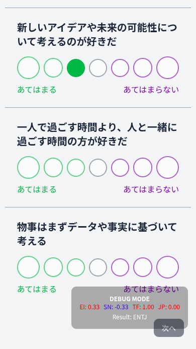
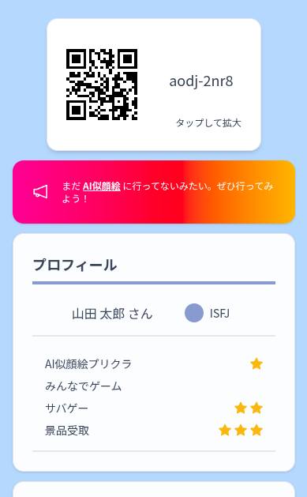
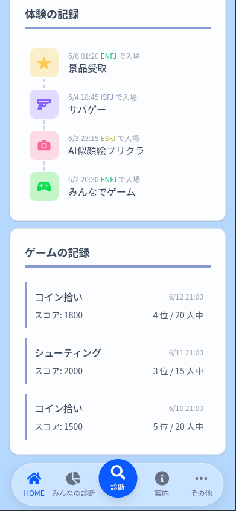

# アプリデザイン依頼

## 基本情報

- タイトル: `Persona Go`(読み: ペルソナ・ゴー)
- キャッチコピー: `あなたの性格が、文化祭をもっと楽しくする！`
- ユーザー向け概要説明:

```txt
Persona Go は、ありたむフェスタの情報システムコースの出し物をもっと楽しむための参加型アプリです。
性格診断をして、自分だけの体験を楽しもう！
出し物をまわると記録がたまり、3つ以上の体験で抽選にも参加できます。
```

## アプリ概要

### 性格診断

- 3-4 分程度で終わる質問に答え、16 種類の正確に分類
- 16 種類の性格はさらに、 4 種のカテゴリーに分類される(この 4 種のカテゴリーは「性格タイプ」と呼ぶ)
- 診断を受けた人の性格を集計し、他の人がどの性格タイプに多いかを確認できる(「みんなの診断」)

### 文化祭出し物の入出場管理

- ユーザーごとに発行される QR コードを出し物入場時にスタッフに読み取ってもらう
- 入場した出し物の履歴をユーザーが確認できる
- 性格タイプごとに出し物でのユーザー体験が変化する
- 3 回入場すると、抽選(情報棟入口のくじ引き)に参加できる(3 回入場したかの判断にも QR コードを利用する)

### 各性格や文化祭情報の確認

- 16 種類の性格の説明を確認できる
- 出し物の案内などの文化祭情報を確認できる

## ユーザーの利用の流れ

### 最初にやること(マイページ表示まで)

1. タイトル画面でアプリの説明を読む
2. 診断-スタート画面でニックネームを入力し、診断を始める
3. 診断-質問画面で質問に答える
4. 診断-結果画面で診断結果を確認する
5. マイページへ移動

### QR コードによる入場

1. 入場時、スタッフに QR コードを読み取ってもらう
2. 出し物によっては性格ごとに異なる体験をする
3. マイページで入場履歴を確認する
4. 3 回入場したら、情報棟入口のくじ引きで抽選に参加する

### その他

- 文化祭情報などを閲覧可
- 他の人がどんな性格なのかを確認可
- 再診断可 -> 別の性格で出し物を体験できる可能性

## 画面

### タイトル画面(`/`)

- 初めて利用するユーザーが最初に見る画面
- アプリの簡単な説明などが書いてある






- ロゴ周辺は未完成(ロゴが決まってから作成)

### 診断-スタート画面(`/user/diagnose`)

- 診断前の簡単な説明
- 初めて利用するユーザーのみ、ニックネームの入力が求められる

### 診断-質問画面(`/user/diagnose/question`)

- 3-4 分程度で終わる質問に答える




### 診断-結果画面(`/user/diagnose/result/[性格ID]`)

- 診断結果の表示
  - 性格名
  - イラスト
  - キャッチコピー
  - 詳細説明
    - 基本的な説明
    - アドバイス
    - 相性に関する説明
  - 関連性のある(相性の説明などで出てきた)性格の商事

### マイページ画面(`/user/dashboard`)

- QR コードフィールド
  - ユーザー ID
  - QR コード
- プロフィールフィールド
  - ユーザー名
  - 性格・性格タイプ
  - 各出し物の入場回数
- 入場履歴フィールド
  - 入場履歴
- ゲームフィールド
  - ゲームの記録(スコア・順位など)
- ナビゲーション
  - HOME
  - みんなの診断
  - 診断
  - 案内
  - その他




### みんなの診断画面(`/user/summary`)

- 未定

### 案内-一覧画面(`/user/info`)

- お知らせ
- 出し物の記事一覧
- マップなどの文化祭情報
- 関連リンク(学生会公式サイト、投票フォームなど)
- 性格の記事一覧

### 案内-出し物画面(`/user/info/attraction/[出し物ID]`)

- 未定

### 案内-性格画面(`/user/info/personality/[性格ID]`)

- 診断-結果画面とほぼ同じ

### その他画面(`/user/more`)

- ユーザー名の変更
- ログアウト
- タイトル画面に戻る

## デザインに関してのリクエスト

### コンセプト・イメージ

- 今年の文化祭テーマ(SAI: **彩**, 祭, 再...)や性格診断(=多様性)をイメージした、カラフルな雰囲気
- シンプルになりすぎず、適度に装飾があるイメージ -> 文化祭の楽しさ・ワクワク感を感じられる
- 子どもでも楽しめるようなワクワクした・ポップなイメージ
- タイトル画面は作っているので、そのイメージに合わせてほしい(タイトル画面自体に変更の提案があればぜひ)
- **最初に、マイページ画面の設計をしてほしい。時点で、診断-質問画面の設計もしてほしい**
- それ以外についてはこちらで大まかなレイアウトを考えるので、ひとまず OK

### 参考: 各性格タイプのテーマカラー

- 性格タイプのテーマカラーが存在する(oklch と RGB 両方で記載)

  1. 赤系統
     - メイン: `pink-500`, `oklch(71.8%, 0.202, 349.761)`,`rgb(251, 100, 182)`
     - サブ: `pink-300`, `oklch(82.3%, 0.12, 346.018)`, `rgb(253, 165, 213)`
  2. 黄系統
     - メイン: `yellow-400`, `oklch(85.2%, 0.199, 91.936)`, `rgb(253, 199, 0)`
     - サブ: `yellow-200`, `oklch(92.4%, 0.12, 95.746)`, `rgb(254, 230, 133)`
  3. 緑系統
     - メイン: `green-400`, `oklch(92.5%, 0.084, 155.995)`, `rgb(5, 223, 114)`
     - サブ: `green-200`, `oklch(90.3%, 0.12, 153.659)`, `rgb(185, 248, 207)`
  4. 青系統
     - メイン: `blue-400`, `oklch(70.7%, 0.165, 254.624)`, `rgb(81, 162, 255)`
     - サブ: `blue-200`, `oklch(88.2%, 0.059, 254.128)`, `rgb(190, 219, 255)`

- 基本的にはメインカラーを使うが、メインカラーを少し薄くしたサブカラーも用意している
- 黄系統を背景にした場合は、文字色を白にすると見づらいので黒推奨
- その他の系統を背景にした場合は、文字色は白推奨

### 参考: アイコンやイラストの利用

- イラストについては、利用規約的に問題がなければフリー素材を利用してもらって構わない
- アイコンについては、[ReactIcons](https://react-icons.github.io/react-icons)を参考にしてほしい(無料で利用できる)

## ロゴに関してのリクエスト

- 現時点では、タイトル画面 + チラシで利用することを想定
- ロゴにアプリ名「Persona Go」を入れてほしい
- ロゴを貼る背景が色付きのため、ロゴマークの縁は白推奨
- 性格タイプのテーマカラーを利用してほしい(4 種類全て)
- 形式は SVG で
