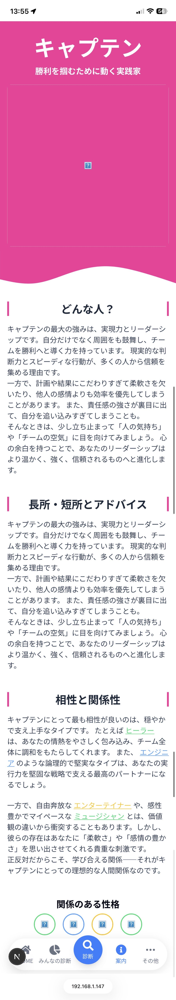

# 診断結果チーム(4I):

性格診断の記事コンテンツの作成をお願いします。

## 参考: 性格一覧

性格一覧は下のリンクにまとめてあります。
https://github.com/aritumn2025/public-spec/blob/main/persona-go/personality.md

もし性格名やキャッチコピーに関して変更したい点があれば、全然してもらって大丈夫です。変更する際はチャットで教えてください。

## 文章の作成

- 文章については、以下の見出しごとに分けて考えてください
  1. 「どんな人？」
     - 性格名とキャッチコピーを交えて、その性格の特徴を説明してください
  2. 「長所・短所とアドバイス」
     - その性格の長所と短所を挙げてください
     - 短所を補うためのアドバイスも添えてください
  3. 「相性と関係性」
     - 相性の良い性格タイプを 2 つ挙げてください
     - 相性の悪い性格タイプを 2 つ挙げてください。ただし、ネガティブすぎる表現は避け、「自分とは正反対で新しい考え方を教えてくれる」や「自分に良い刺激/影響を与えてくれる」のように最終的にはポジティブな表現でまとめてもらえるとよいです。
- 昨日、相性の良い/悪い性格をこちらで考えると伝えましたが、文章作成の際に一緒に考えてください。(急な変更になってしまい申し訳ありません 🙇‍♀️ )
- 「16 種類の性格の相性の良い/悪い性格にこの性格が一度も出てきてない」というようなことがあるかもしれませんが、そこまで考えると大変かと思うので、あまり気にしなくて大丈夫です。
- それと、少し技術的な話になりますが、web で表示する際に改行したい部分を`<br />`で表現してもらえると嬉しいです。

```html
キャプテンの最大の強みは、実現力とリーダーシップです。自分だけでなく周囲をも鼓舞し、チームを勝利へと導く力を持っています。 <!-- ここで改行してますが、webで表示する際には改行されません -->
現実的な判断力とスピーディな行動が、多くの人から信頼を集める理由です。
<br /> <!-- ここで改行されます -->
一方で、計画や結果にこだわりすぎて柔軟さを欠いたり、他人の感情よりも効率を優先してしまうことがあります。
また、責任感の強さが裏目に出て、自分を追い込みすぎてしまうことも。
<br /> <!-- ここで改行されます -->
そんなときは、少し立ち止まって「人の気持ち」や「チームの空気」に目を向けてみましょう。
心の余白を持つことで、あなたのリーダーシップはより温かく、強く、信頼されるものへと進化します。
```

- chatGPT 等の AI を活用してもらって構いません。むしろ、16 種類分を人力で考えるのはかなり大変かと思うので、積極的に活用してください。プロンプト例をあげているので、これをそのままコピペして使ってもらっても構いません。→ [性格記事\_プロンプト例.md](./性格記事_プロンプト例.md)

## 文章の例

### どんな人？

```html
キャプテンは、「情熱タイプ」の中でも特に実行力と責任感に優れたリーダー的存在です。
人と関わることでエネルギーを得ながらも、目標を達成するためには現実的な手段を選ぶ“行動の人”でもあります。
<br />
困難な状況でも諦めず、チームをまとめながら前進する姿は、まさに頼れるキャプテンそのものです。
<br />
明確な目的意識と強い意志を持ち、どんな環境でも「どうすればできるか」を考え、結果を出すことに情熱を注ぎます。
```

### 長所・短所とアドバイス

```html
キャプテンの最大の強みは、実現力とリーダーシップです。自分だけでなく周囲をも鼓舞し、チームを勝利へと導く力を持っています。
現実的な判断力とスピーディな行動が、多くの人から信頼を集める理由です。
<br />
一方で、計画や結果にこだわりすぎて柔軟さを欠いたり、他人の感情よりも効率を優先してしまうことがあります。
また、責任感の強さが裏目に出て、自分を追い込みすぎてしまうことも。
<br />
そんなときは、少し立ち止まって「人の気持ち」や「チームの空気」に目を向けてみましょう。
心の余白を持つことで、あなたのリーダーシップはより温かく、強く、信頼されるものへと進化します。
```

### 相性と関係性

```html
キャプテンにとって最も相性が良いのは、穏やかで支え上手なタイプです。
たとえば「ヒーラー」は、あなたの情熱をやさしく包み込み、チーム全体に調和をもたらしてくれます。
また、「エンジニア」のような論理的で堅実なタイプは、あなたの実行力を堅固な戦略で支える最高のパートナーになるでしょう。
<br />
<br />
一方で、自由奔放な「エンターテイナー」や、感性豊かでマイペースな「ミュージシャン」とは、価値観の違いから衝突することもあります。
しかし、彼らの存在はあなたに「柔軟さ」や「感情の豊かさ」を思い出させてくれる貴重な刺激です。
<br />
正反対だからこそ、学び合える関係――それがキャプテンにとっての理想的な人間関係なのです。
```

### 記事の完成イメージ

- まだ開発途中なので、デザインが変更される可能性があります。
- イラストができていないので、イラスト部分は空欄になっています。
  

## イラストの作成

- イラストについては、以下のようにお願いします
  - イラストについては、各性格のイメージに合うものをお願いします
  - サイズについては、縦横比 1:1 でお願いします。解像度については特に指定はないです。
  - 背景は透過でお願いします
  - キャラクターの男女比はちょうど半分にしてください
