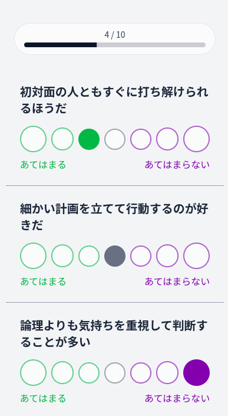

# 診断結果チーム(3I):

質問内容の作成をお願いします。

## 参考: 性格一覧

性格一覧は下のリンクにまとめてあります。
https://github.com/aritumn2025/public-spec/blob/main/persona-go/personality.md

## 診断ロジックの概要

- 4 つの評価軸に基づいて性格タイプを分類
- 各評価軸は 2 つの対立する性質からなり、質問に対する回答によって正か負のスコアが加点される
- 最終的に各軸のスコアの正負の組み合わせで性格タイプを決定

### 評価軸

| 軸 ID  | 名称（日本語 / 英語）                              | 対立軸（正方向 ↔ 負方向）         | 説明                                                                 |
| :----- | :------------------------------------------------- | :-------------------------------- | :------------------------------------------------------------------- |
| **EI** | 外向性 ↔ 内向性（**Extraversion ↔ Introversion**） | 他人と関わる ↔ 一人で思考する     | 社交性やエネルギーの向きを示す軸。社交的か、内省的か。               |
| **TF** | 論理型 ↔ 感情型（**Thinking ↔ Feeling**）          | 理性重視 ↔ 共感重視               | 判断や意思決定の基準。合理性を重視するか、人の気持ちを重視するか。   |
| **SP** | 構造型 ↔ 自由型（**Structured ↔ Spontaneous**）    | 計画的・秩序重視 ↔ 柔軟・即興的   | 生活や行動のスタイル。ルールや計画を重んじるか、柔軟さを優先するか。 |
| **AM** | 現実型 ↔ 創造型（**Analytic ↔ Imaginative**）      | 現実的・実証主義 ↔ 創造的・空想的 | 情報やアイデアの捉え方。論理的・現実的か、直感的・創造的か。         |

例えば、最終スコアが`{EI: +, TF: -, SP: +, AM: -}`の場合、「外向性」「感情型」「構造型」「創造型」の組み合わせ(`EFSM`)となります。

### 記事の完成イメージ

- まだ開発途中なので、デザインが変更される可能性があります。
  

### 質問の設定方法

- 1 問あたりの質問で設定するのは、主に以下の要素です。

  - 質問文
  - 左の選択肢の文言とスコア
  - 右の選択肢の文言とスコア

- 左/右の選択肢というのは、例えば以下のようなイメージです。

  - 例えば、左に「あてはまる」、右に「あてはまらない」という文言を設定し、7 段階評価で回答してもらうイメージです。
  - なお、設定していない中間の段階については、自動的にスコアが補完されます。
  - 例:

    - 質問内容: 「外で遊ぶのが好き？」
    - 左の選択肢: 「あてはまる」→ EI 軸に +1 点
    - 右の選択肢: 「あてはまらない」→ EI 軸に -1 点

    - 選択肢は 7 段階評価で以下のように表示される

    > あてはまる ○ 　 ○ 　 ○ 　 ○ 　 ○ 　 ○ 　 ○ あてはまらない

  - この場合、例えば一番左の選択肢を選んだ場合は EI 軸に 1 点が加点される。
  - 一番右の選択肢を選んだ場合は EI 軸に -1 点が加点される。
  - 真ん中の選択肢を選んだ場合は 左と右のちょうど中間なので、EI 軸に 0 点が加点される。
  - それ以外の選択肢についても、左と右のスコアから計算してちょうどいい値が自動的に加点される。

## 設定例

```
質問文: 「新しいアイデアを考えるのが好き？」
左の選択肢: 「あてはまる」→ AM 軸に +1 点
右の選択肢: 「あてはまらない」→ AM 軸に -1 点

// これを24 問分作成
```

- chatGPT 等の AI を活用してもらって構いません。むしろ、24 問を人力で考えるのはかなり大変かと思うので、積極的に活用してください。プロンプト例をあげているので、これをそのままコピペして使ってもらっても構いません。→ [質問内容\_プロンプト例.md](./質問内容_プロンプト例.md)
- 上にあるプロンプトを使うと、よくわからない形式(JavaScript のオブジェクト形式)で設定が出力されるかもしれませんが、気にせず質問文とスコア設定だけ抜き出して使ってください。

### 一貫性を保つためのガイドライン

- 選択肢は左に肯定的、右に否定的な意味合いの文言を設定する
- 選択肢の文言とは自由に設定できるが、基本的には 左: 「あてはまる」右: 「あてはらない」などで統一するようにする
- 24 問を 4 つに分割し、各評価軸ごとに 6 問ずつ設定することを推奨
  - 例: EI 軸に関する質問を 6 問、TF 軸に関する質問を 6 問、... のように分割
  - 各評価軸に関する質問で、左の選択肢を全て選択するとどちらかに傾くというようなことがないようにバランスよく設定する(つまり、E 寄りの人が EI 軸の質問で全て左を選ぶようなことがないように質問文を工夫する)
